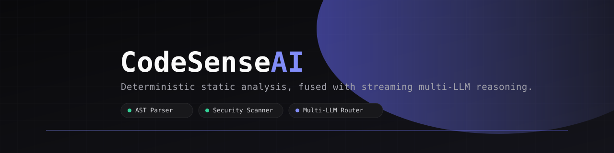
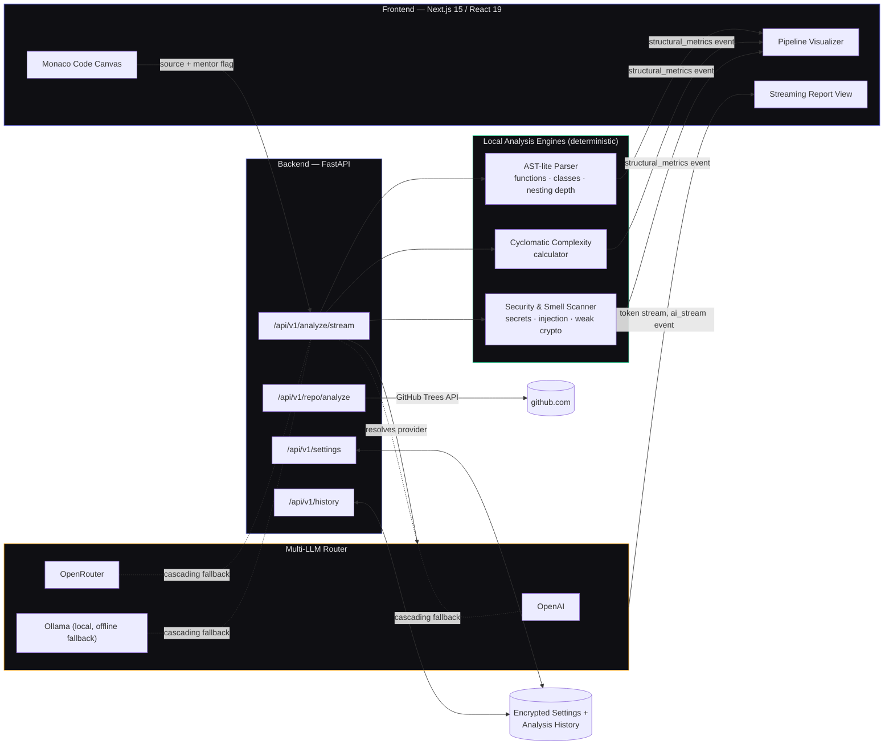
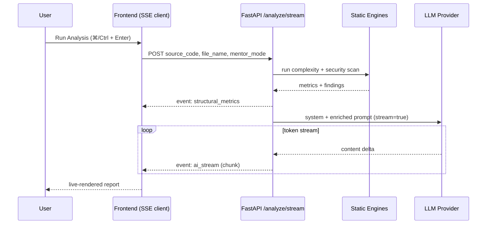

<div align="center">



<br/>

[](./backend)
[](./frontend)
[](./frontend)
[](./backend)
[](#license)
[](#contributing)

**An AI-assisted code review engine that pairs deterministic static analysis with streaming, multi-provider LLM reasoning — in a live Monaco-powered editor.**

[Features](#-features) • [Architecture](#-architecture) • [Getting Started](#-getting-started) • [API Reference](#-api-reference) • [Roadmap](#-roadmap)

</div>

<br/>

## Overview

CodeSense AI is a full-stack code review tool: paste or open a source file, and it runs a fast local analysis pass — cyclomatic complexity, AST-lite structural parsing, and regex-based security/secret scanning — before handing that context off to an LLM that streams back a full engineering report in real time. Everything renders live in a split-pane workspace built around a Monaco editor, so results appear token-by-token as the model reasons through your code.

It's designed to be provider-agnostic: bring your own OpenAI or OpenRouter key, or run entirely offline against a local [Ollama](https://ollama.com) model.

<br/>

## ✨ Features

| | |
|---|---|
| 🧠 **Streaming AI Analysis** | Server-Sent Events pipeline streams structural metrics first, then tokenizes the AI-generated report live into the UI — no waiting on a single blocking request. |
| 🔍 **Deterministic Static Engine** | Local, non-LLM passes compute cyclomatic complexity, nesting depth, and structural signatures (functions, classes, loops, branches) before any AI call is made. |
| 🛡️ **Security & Smell Scanner** | Regex-driven detection for hardcoded secrets/API keys, SQL & command injection patterns, weak cryptography (MD5/SHA1), and long-line code smells. |
| 🔀 **Multi-LLM Provider Routing** | Cascades through OpenAI → OpenRouter → local Ollama automatically based on which API keys are configured, with per-request provider override support. |
| 🎓 **Mentor Mode** | Toggle a Socratic teaching mode that reframes the AI's output as guided explanation rather than a flat report. |
| 📦 **GitHub Repo Scanner** | Point it at any public `github.com/user/repo` URL to pull the file tree, language distribution, and an architecture/health snapshot without cloning. |
| 🔐 **Encrypted Key Vault** | User-supplied provider API keys are encrypted at rest (Fernet/AES) before being persisted. |
| 🕘 **Analysis History** | Past runs are persisted per user (file name, language, score, timestamp) for later review. |
| 💻 **Live Code Canvas** | Monaco-based editor (the engine behind VS Code) with syntax highlighting and a `Cmd/Ctrl + Enter` shortcut to trigger analysis instantly. |

<br/>

## 🏗 Architecture

CodeSense AI is a two-service system: a Next.js client and a FastAPI backend that orchestrates local analysis engines and downstream LLM calls over a single SSE stream.



**Request lifecycle for a single analysis run:**



<br/>

## 🧰 Tech Stack

<table>
<tr>
<td valign="top" width="50%">

**Backend**
- FastAPI + Uvicorn
- Pydantic v2 / pydantic-settings
- SQLAlchemy 2.0 + Alembic (migrations)
- `cryptography` (Fernet key vault)
- `openai` SDK (used against OpenAI, OpenRouter, and Ollama's OpenAI-compatible endpoint)
- Server-Sent Events for streaming

</td>
<td valign="top" width="50%">

**Frontend**
- Next.js 15 / React 19
- `@monaco-editor/react`
- Tailwind CSS 3
- Framer Motion
- Lucide icons

</td>
</tr>
</table>

<br/>

## 📁 Project Structure

```
codesense-ai/
├── backend/
│   ├── app/
│   │   ├── api/v1/
│   │   │   ├── analyze.py       # SSE streaming analysis endpoint
│   │   │   ├── repo.py          # GitHub repository scanner
│   │   │   ├── settings.py      # Encrypted provider key vault
│   │   │   └── history.py       # Per-user analysis history
│   │   ├── core/
│   │   │   ├── llm.py           # Multi-provider LLM routing + streaming
│   │   │   ├── pipeline.py      # Analysis pipeline orchestration helpers
│   │   │   └── security.py      # Fernet-based key encryption
│   │   ├── engines/
│   │   │   ├── ast_parser.py    # Structural signature extraction
│   │   │   ├── complexity.py    # Cyclomatic complexity scoring
│   │   │   └── static_analyzer.py # Security & code-smell regex scanner
│   │   ├── db/                  # SQLAlchemy models + session
│   │   ├── config.py
│   │   └── main.py              # FastAPI app entrypoint
│   ├── alembic.ini
│   └── requirements.txt
└── frontend/
    └── src/
        ├── app/                 # Next.js App Router pages (dashboard, history, repo, settings)
        ├── components/          # Editor, PipelineVisualizer, ReportView, Sidebar
        ├── hooks/                # Keyboard shortcut handling
        └── lib/                 # API client, utilities
```

<br/>

## 🚀 Getting Started

### Prerequisites

- Python 3.11+
- Node.js 18.18+ and npm
- (Optional, for the offline fallback) [Ollama](https://ollama.com) running locally with a coding model pulled, e.g. `ollama pull qwen2.5-coder`

### 1. Clone the repo

```bash
git clone https://github.com/dikshith-shetty-3621/codesense-ai.git
cd codesense-ai
```

### 2. Backend setup

```bash
cd backend
python -m venv venv
source venv/bin/activate      # Windows: venv\Scripts\activate
pip install -r requirements.txt
```

Create a `.env` file in `backend/` (copy from `.env.example`):

```bash
cp .env.example .env
# Edit .env and set at minimum:
#   ENCRYPTION_SECRET_KEY=<generate with: python -c "from cryptography.fernet import Fernet; print(Fernet.generate_key().decode())">
#   DATABASE_URL=sqlite:///./codesense.db
#   CORS_ORIGINS=http://localhost:3000
#   API_AUTH_TOKEN=<optional — set to protect endpoints with Bearer auth>
```

Run migrations and start the API:

```bash
alembic upgrade head
uvicorn app.main:app --reload --port 8000
```

The API will be live at `http://localhost:8000`, with interactive docs at `http://localhost:8000/docs`.

### 3. Frontend setup

```bash
cd ../frontend
npm install

# Create a .env.local (copy from .env.local.example):
cp .env.local.example .env.local
# NEXT_PUBLIC_API_URL defaults to http://localhost:8000 if not set

npm run dev
```

Open `http://localhost:3000` — the dashboard loads with a sample snippet pre-filled so you can hit **Run Analysis** immediately.

### 4. (Optional) Local LLM fallback

If no OpenAI or OpenRouter key is configured, the backend automatically routes to a local Ollama instance:

```bash
ollama serve
ollama pull qwen2.5-coder
```

<br/>

## 📡 API Reference

| Method | Endpoint | Description |
|---|---|---|
| `POST` | `/api/v1/analyze/stream` | Runs the static engines, then streams an AI-generated report over SSE (`structural_metrics` → `status` → `ai_stream` events). |
| `POST` | `/api/v1/repo/analyze` | Scans a public GitHub repo URL and returns file distribution + architecture snapshot. |
| `POST` | `/api/v1/settings/keys` | Stores an encrypted provider API key for a user. |
| `POST` | `/api/v1/settings/update` | Updates a user's default provider/model preferences. |
| `GET`  | `/api/v1/history/{user_id}` | Returns a user's past analysis runs. |
| `GET`  | `/health` | Liveness check (no auth required). |

> **Authentication:** If `API_AUTH_TOKEN` is set in `backend/.env`, all endpoints (except `/health` and `/docs`) require an `Authorization: Bearer <token>` header. The frontend reads `NEXT_PUBLIC_API_AUTH_TOKEN` from `frontend/.env.local` to send this automatically.

Full request/response schemas are available via the auto-generated OpenAPI docs at `/docs` once the backend is running.

<br/>

## 🗺 Roadmap

- [ ] Swap regex-based AST parsing for a real tree-sitter grammar per language
- [ ] Multi-file / whole-repository analysis (beyond single-file + repo metadata scan)
- [ ] Inline diff view for AI-suggested refactors
- [ ] Auth (currently `user_id` is caller-supplied — add proper session-based auth)
- [ ] CI pipeline (lint, type-check, test) via GitHub Actions
- [ ] Dockerfile + docker-compose for one-command local spin-up

<br/>

## 🤝 Contributing

Contributions are welcome. If you'd like to help:

1. Fork the repo and create a feature branch (`git checkout -b feature/your-idea`)
2. Make your changes with clear, focused commits
3. Open a pull request describing what changed and why

Please open an issue first for larger changes so we can discuss direction before you invest time in it.

<br/>

## 📄 License

Distributed under the MIT License. See `LICENSE` for details.

<br/>

<div align="center">

Built by [Diganth Shetty](https://linkedin.com/in/diganth-shetty)

</div>
